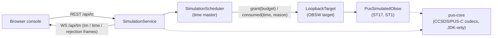

# SatSim

[](https://github.com/cmoellmann/satsim/actions/workflows/ci.yml)

A satellite simulator with a byte-exact ECSS PUS-C TM/TC interface and a live
web console, for developing and automatically testing satellite on-board
software (OBSW). Built AI-assisted under a tailored ECSS-E-ST-40C/Q-ST-80C
process — with documented, machine-enforced human controls.


*The console after one ping with default acknowledgement flags: acceptance
report, service report, completion report — each row expandable to a
field-level breakdown down to the CRC.*

## What SatSim is

SatSim is two experiments in one repository. The **engineering experiment**:
a simulator that speaks strict PUS-C (ECSS-E-ST-70-41C) over CCSDS space
packets, built with the same discipline applied to real flight software — a
tailored ECSS process, a byte-level ICD with authoritative reference vectors,
spec-first validation, full requirement-to-test traceability, and
deterministic replay. The **methodology experiment**: the project is
deliberately AI-assisted (Claude / Claude Code) under explicit controls — AI
proposes, the human decides; reference vectors and expected test results are
human-approved and *immutable to the AI*; everything enters the baseline via
reviewed PR. Several of the safeguards, including the immutability rule
itself, originated as AI proposals that the human evaluated and approved.
The question behind both: can one engineer with 15 years of onboard-software
experience use AI-assisted development to produce flight-software-grade
engineering at a fraction of the traditional effort — *without* sacrificing
the integrity that makes it flight-grade? This repository is the running
answer.

What the PoC covers today:

- **PUS-C over CCSDS space packets**, strictly tailored: ST[17] connection
  test and the ST[1] request verification subset live; ST[3] housekeeping
  specified and next (M1b). Single APID, CUC 4+2 on-board time.
- **Deterministic simulated time** — the scheduler is the sole time master
  (ADR-0006); wall-clock access in simulation logic is banned *by the build*.
  Identical scripted runs produce SHA-256-identical TM streams, timestamps
  included.
- **Process-isolated OBSW targets** behind two narrow contracts
  (`SpaceLink`, `EmulatorControl`): the entire validation suite must pass
  unchanged against any conforming target — a conformance kit for
  progressively more real spacecraft software.
- **A thin web console**: running OBT clock, live packet log with rejection
  rows and field-level detail view, compose form whose hex preview *is* the
  ICD reference vector.
- **A live ECSS document set**: requirements and test cases machine-parsed
  by CI, ICD vectors immutable, milestone gates recorded as auditable
  reports.
- **Tiered AI staffing** under committed agent definitions: cheaper models
  implement well-specified chunks, the senior model reviews, the human
  merges.

## Architecture



The scheduler *grants* time budgets to the OBSW target and the target reports
back what it *consumed* (ADR-0006) — simulated time never runs ahead of its
master, which is what makes byte-identical replay possible.

## Highlights

- **The ECSS standards are the input, not the afterthought.** The controlled
  document set below exists for real and is *live*: parsed by CI, gated at
  milestones, or both. The process gives the AI hard rails; the AI makes the
  process affordable at PoC scale.
- **Specs are immutable to the AI.** If implementation and spec disagree, the
  AI must stop and report a finding — never adjust the spec to make a test
  pass. This rule has caught real defects: a negative test vector whose stale
  CRC masked the check it existed to verify, found while generating vectors.
- **Traceability and review obligations are CI gates.** Requirement → SVS
  case → annotated test is machine-checked on every PR (its first dry-run
  found a spec gap); missing human review verdicts fail the build (ACT-004).
  The gate even failed one of its own PRs — and was right.
- **Determinism is build-enforced.** The wall-clock ban is a Checkstyle
  forbidden-API gate with one sanctioned suppression; the replay test proves
  two identical runs yield SHA-256-identical TM streams.
- **The on-board software is a plug, not a partner.** Today an in-process
  loopback, next a native C/Rust demo process, then flight binaries under
  instruction-level emulators (QEMU, TSIM, Terma TEMU) — same validation
  suite, unchanged (SIM-REQ-LINK-003).
- **Change and staffing go through process, not chat.** Scope changes are
  SCRs with per-document impact analyses, dispositioned by PR review; routine
  implementation is delegated to cheaper models under committed agent
  definitions with bounded authority, every delegated diff reviewed before
  commit.

## Status

| Milestone | Date | Scope | Gate record |
|---|---|---|---|
| [`M0`](https://github.com/cmoellmann/satsim/releases/tag/M0) | 2026-07-18 | Walking skeleton: build, CI, interface trio, loopback target, CRC + primary header codecs | [M0 report](docs/test-reports/M0-report.md) |
| [`M1`](https://github.com/cmoellmann/satsim/releases/tag/M1) | 2026-07-18 | TC(17,1)→TM(17,2) chain: PUS-C codecs, time-mastered scheduler, REST/WS API, web console, determinism replay | [M1 report](docs/test-reports/M1-report.md) |
| [`M1a`](https://github.com/cmoellmann/satsim/releases/tag/M1a) | 2026-07-18 | HMI package ([SCR-003](docs/scr/SCR-003-hmi-improvements.md)): OBT clock, rejection rows, detail view. ST[1] request verification ([SCR-002](docs/scr/SCR-002-st1-verification.md)): TM(1,1)/(1,2)/(1,7) | [M1a report](docs/test-reports/M1a-report.md) |

Currently: **93/93 tests green**, pus-core line coverage **95.74 %**
(indicative target 80 %), traceability gate at 0 findings.
**Next: M1b** — ST[3] housekeeping per
[SCR-001](docs/scr/SCR-001-st3-housekeeping.md); periodic telemetry flows
before the user sends anything.

## Document set

| Document | File | What it is |
|---|---|---|
| Software Development Plan (SDP) | [docs/sdp.md](docs/sdp.md) | Process, ECSS tailoring matrix, milestones M0–M5 with exit criteria, action register, AI-governance controls (§6) |
| Software Requirements Specification (SRS) | [docs/srs.md](docs/srs.md) | Numbered requirements in a strict table format, machine-parsed by the CI traceability gate |
| Software Validation Specification (SVS) | [docs/svs.md](docs/svs.md) | Spec-first validation test case definitions with human-approved expected results |
| Interface Control Document (ICD) | [docs/icd.md](docs/icd.md) | Byte-level TM/TC contract with authoritative reference vectors (§6) and CRC anchors (§7) |
| Software Design Document (SDD) | [docs/sdd.md](docs/sdd.md) | As-built architecture to class level: modules, threads, key flows |
| Architecture decisions (ADR) | [docs/adr/DECISION-LOG.md](docs/adr/DECISION-LOG.md) | Immutable decision log; [ADR-0006](docs/adr/ADR-0006-simulation-time-ownership.md) (simulation time ownership) as the full-form sample |
| Software Change Requests (SCR) | [docs/scr/SCR-LOG.md](docs/scr/SCR-LOG.md) | Change-control register; each SCR carries a per-document impact analysis and a recorded disposition |
| Software Reuse File (SRF) | [docs/reuse-file.md](docs/reuse-file.md) | Dependency/license register (Q-ST-80C style): version, scope, SPDX license, approval record |
| Milestone test reports | [docs/test-reports/](docs/test-reports/) | Gate records ([M0](docs/test-reports/M0-report.md), [M1](docs/test-reports/M1-report.md), [M1a](docs/test-reports/M1a-report.md)): test results, coverage, traceability matrix, human review verdicts |
| AI working rules | [CLAUDE.md](CLAUDE.md) | Controlled document: project context and the hard rules every AI session runs under |
| AI agent definitions | [.claude/agents/README.md](.claude/agents/README.md) | Tiered delegation setup: implementer + scribe agents with bounded authority |

## Getting started

Build: `./mvnw -q verify` (Java 21; Maven 3.9.11 via committed wrapper — no
network resources required at test time).

Run the simulator:

```
./mvnw -q package
java -jar simulator/target/simulator-0.1.0-SNAPSHOT.jar
```

then open http://localhost:8090 — compose a TC(17,1) ping (the hex preview
shows the exact ICD vector), send it, and watch TM(1,1), TM(17,2), TM(1,7)
arrive in the live log. REST/WebSocket API per [ICD §8](docs/icd.md):
`POST /api/tc`, WS `/api/tm`.

For a quick tour of the methodology, read
[ADR-0006](docs/adr/ADR-0006-simulation-time-ownership.md) for a sample of the
decision process, [SDP §6](docs/sdp.md) for the AI-governance controls, and
the [M0 report](docs/test-reports/M0-report.md) for what a milestone gate
produces.

## Current limitations

- **In-process loopback target only.** No real OBSW binary runs yet — the
  target seam exists precisely for that, but native processes arrive at M3
  and emulated flight binaries at M5.
- **Tailored service subset.** ST[17] and the ST[1]
  acceptance/completion subset are live; ST[3] housekeeping is specified but
  not implemented (M1b). TM(1,8) completion-failure reports are dormant until
  a service with semantic execution errors exists (M1b, ICD OP-3).
- **Single APID (100), single ground source, strict PUS-C only** — by
  design (ADR-0002/0003), not by accident.
- **The web console is a PoC HMI, not a mission control system.** It paces
  simulated time 1:1 against wall clock for interactive use; the scheduler
  underneath can jump arbitrarily (that's what the tests do), but the UI
  exposes no fast-forward yet.
- **No external transport.** The TCP length-framed space-packet link (M2)
  and Yamcs attachment (M4) are not built yet; today the only way in is
  REST/WS.
- **No LICENSE file yet** (SRF-OPEN-1) — the repository is public source,
  not yet open source; the license decision is tracked and pending.
- **Coverage target on pus-core only** (SDP §2.1 tailoring); other modules
  are covered by validation tests without a numeric bar.

## Roadmap

Planned increments per [SDP §4](docs/sdp.md), each behind a milestone gate:

- **M1b** — ST[3] housekeeping subset ([SCR-001](docs/scr/SCR-001-st3-housekeeping.md)):
  create/enable/disable report structures, periodic TM(3,25), default
  structure reporting at startup.
- **M2** — TCP length-framed space-packet link: external client demo over
  TCP, conformance-tested framing.
- **M3** — native OBSW demo process (small C or Rust ST[17] responder):
  the same validation suite green against a second, out-of-process target.
- **M4** — Yamcs attachment trial: TC/TM round-trip from a real mission
  control client over the M2 link.
- **M5** — first emulator adapter (QEMU): validation suite green against an
  OBSW binary under instruction-level emulation, time-sync conformance
  proven.

Ideas beyond the current plan — each would enter via SCR, not by quiet scope
growth: further PUS services (ST[5] events, ST[11] time-tagged commands,
ST[12] monitoring), fault injection on the space link, commercial emulators
(TSIM, Terma TEMU/cOBC), multi-APID / multi-spacecraft scenarios.

---

All AI-generated content in this repository — code, documents, this README —
enters the baseline only via human-reviewed pull request.
