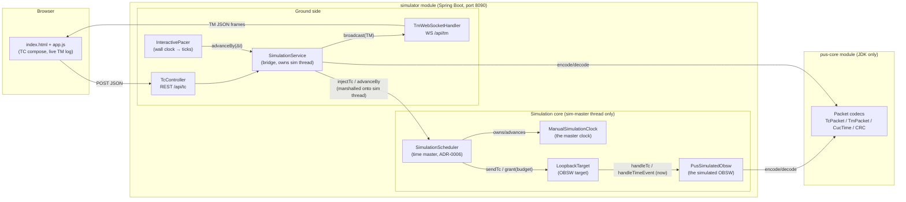
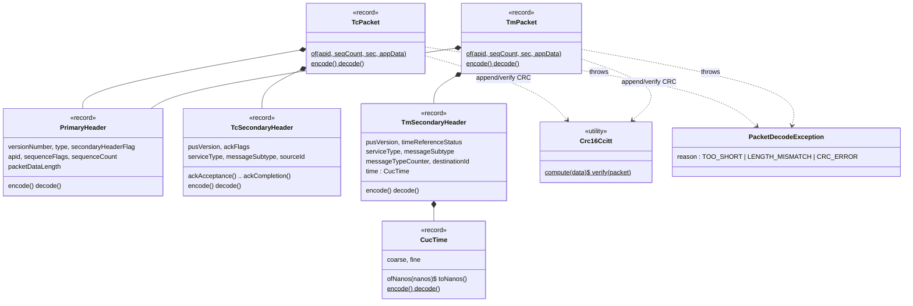
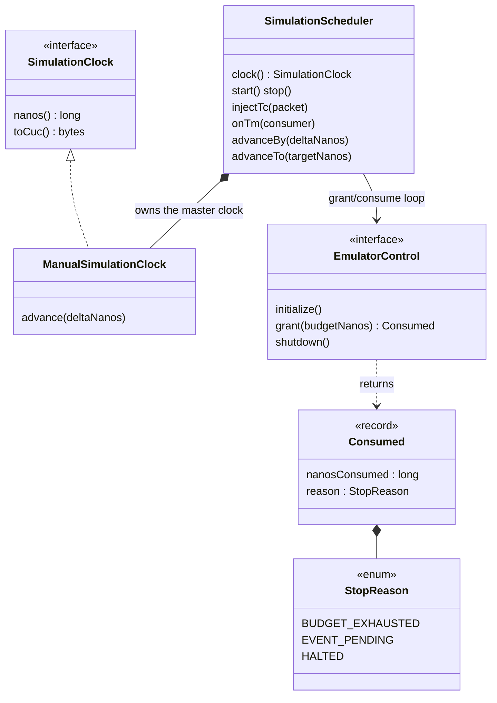
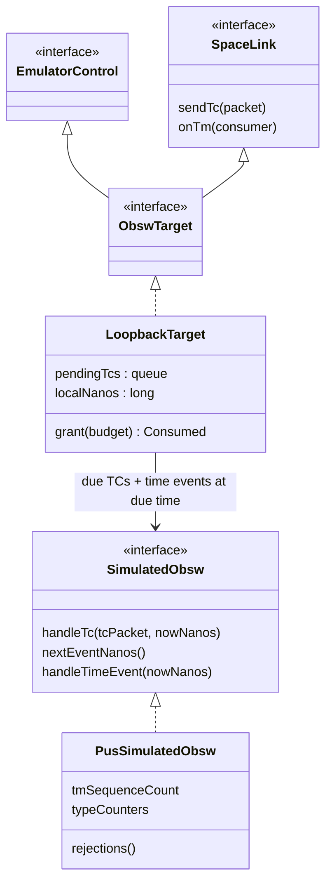
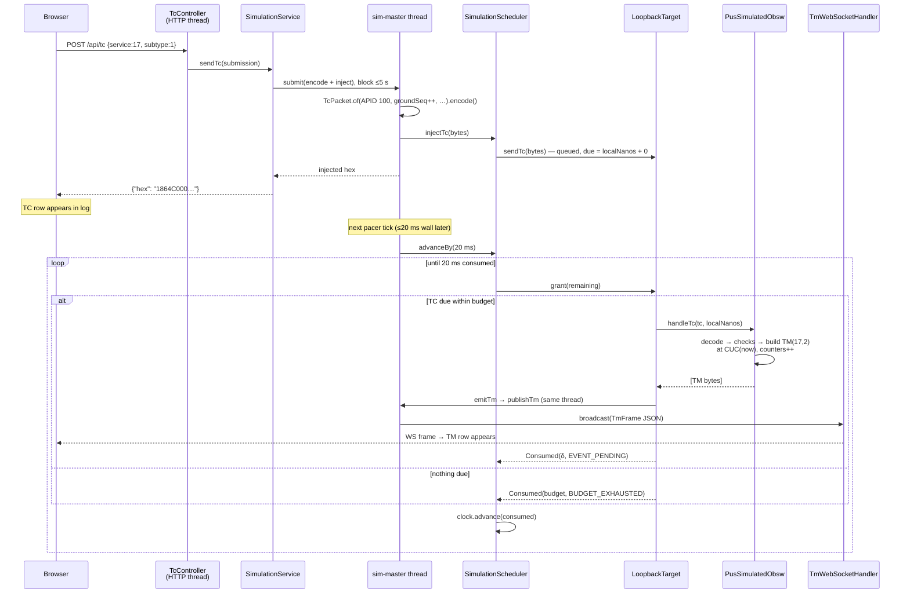

# SatSim Software Design Document (SDD)

- Configuration item: SATSIM-SDD, Issue 1 (draft)
- Scope: as-built architecture at the **M1** baseline (tag `M1`), plus marked
  extension points for M1a–M5. Descriptive, not normative: requirements live in
  the SRS, byte-level contracts in the ICD, decisions in the ADRs. If this
  document and the code disagree, the code (and its tests) win and this
  document gets a new issue.
- Per SDP §2.1 tailoring: lightweight SDD; design risk is carried by the ADR
  process. This document explains *what exists and how it fits together*; the
  *why* is in `docs/adr/`.
- Reading guide: §2 gives the one-page mental model. §3 walks through every
  class. §4 explains threads. §5 walks through the key scenarios end to end.
  If you read only one section, read §2; if something is unclear, §5 usually
  resolves it.

## 1. Purpose, references, conventions

The SDD answers: **who does what, who talks to whom, and on which thread**.
It exists because the architecture spans three Maven modules, two "seam"
interfaces, and a deliberately unusual time regime (simulated time only), and
that is hard to reconstruct from Javadoc alone.

References: `docs/icd.md` (packet formats §2–§7, web API §8),
`docs/srs.md` (requirement IDs cited as [SIM-REQ-…]), `docs/adr/DECISION-LOG.md`
(ADR-0001…0006), `docs/sdp.md` (process, milestones).

Conventions in this document:

- **Ground side** = browser frontend + Spring web layer. **Space side** =
  everything behind the `SpaceLink` seam (OBSW target + simulated
  OBSW).
- Arrows in diagrams point in the direction of *calls*, not data flow, unless
  labelled otherwise.
- "Simulated time" is always nanoseconds since the epoch 2026-01-01T00:00:00
  UTC (ADR-0004). "Wall clock" is real time and is banned from simulation
  logic [SIM-REQ-TIME-001].

## 2. Architecture overview

### 2.1 The one-page mental model

SatSim is a **ground segment and a simulated spacecraft in one JVM**, joined
by two narrow interfaces and driven by one clock that only moves when the
time master says so.

The load-bearing ideas, each fixed by an ADR:

1. **Two seams isolate the spacecraft side** (ADR-0001, ADR-0006).
   `SpaceLink` carries encoded space packets; `EmulatorControl` carries time
   grants. `ObswTarget` is simply both seams in one interface. Anything that
   implements `ObswTarget` — today an in-process loopback, later a native
   OBSW process (M3) or an emulator like QEMU (M5+) — can be plugged in
   without touching the rest [SIM-REQ-LINK-003].
2. **The scheduler is the sole time master** (ADR-0006). Simulated time
   advances *only* inside `SimulationScheduler.advanceBy`, and only by the
   amount the target reports as consumed. Nothing else moves the clock; no
   simulation code reads the wall clock. Real-time behavior for the frontend
   is an *optional pacing policy* (`InteractivePacer`) layered on top —
   remove it and the same simulation runs deterministically fast in tests.
3. **The packet library is inert** (CLAUDE.md rule 5). `pus-core` contains
   pure, framework-free value types and codecs. It never does I/O, never
   knows about time sources, Spring, or threads. Both sides use it: the
   ground side to compose/decode, the simulated OBSW to decode/compose.
4. **Single writer for all simulation state** (§4). Every touch of scheduler,
   target, OBSW state happens on one dedicated thread (`sim-master`),
   marshalled through `SimulationService`. No simulation class is
   thread-safe, on purpose — they don't need to be.

### 2.2 Module and dependency structure

| Module | Contents | Depends on | Constraint |
|---|---|---|---|
| `pus-core` | CCSDS/PUS-C packet value types + codecs (§3.1) | JDK only | Framework-free forever (CLAUDE.md rule 5); indicative 80% coverage target |
| `simulator` | Simulation core, OBSW targets, web API, pacing, Spring wiring (§3.2) | `pus-core`, Spring Boot | Only module allowed to contain Spring types |
| `sim-test-support` | `@Requirement`/`@TestCase` annotations + `TraceabilityCheck` CI tool (§3.3) | JDK only | Test/process scope only, never on a production classpath |

The frontend (`simulator/src/main/resources/static/`: `index.html`,
`app.js`, `style.css`) is plain HTML/JS/CSS served by Spring Boot as static
resources — no build step, no framework (ADR-0005).

## 3. Static design — packages and classes

### 3.1 `pus-core` — the packet library

Everything here is an immutable Java `record` (except the stateless
`Crc16Ccitt` and the exception) with symmetric `encode()`/`decode()` methods
implementing the byte layouts of ICD §2–§7. Decoders validate structure, not
policy: PUS-version and service checks are deliberately *not* here but in the
simulated OBSW (ICD §10.2), so malformed and policy-violating packets
can be told apart.

| Class (package) | Responsibility | Notes |
|---|---|---|
| `ccsds.PrimaryHeader` | 6-octet CCSDS primary header codec (ICD §2) [SIM-REQ-PUS-001] | Carries the raw `packetDataLength` field (octets − 1); `dataFieldOctets()` gives the real count. Accepts full CCSDS ranges — system conventions (APID 100, unsegmented…) are the *callers'* contract |
| `ccsds.PacketType` | TC/TM type bit | `TC=1`, `TM=0` |
| `ccsds.SequenceFlags` | Segmentation flags | SatSim only uses `UNSEGMENTED`, but the codec covers all values so decoding never loses information |
| `tc.TcSecondaryHeader` | 5-octet PUS-C TC secondary header codec (ICD §3) [SIM-REQ-PUS-003] | Ack-flag accessors (bit3 acceptance … bit0 completion). Does **not** enforce PUS version 2 — that is simulator policy |
| `tc.TcPacket` | Complete TC packet: primary + secondary + app data + CRC [SIM-REQ-PUS-003] | Construction cross-checks header length vs. content; `decode` checks, in order: minimum length → declared-length match → CRC [SIM-REQ-PUS-005]. App data defensively copied |
| `tm.TmSecondaryHeader` | 13-octet PUS-C TM secondary header codec (ICD §4) [SIM-REQ-PUS-004] | Embeds `CucTime` |
| `tm.TmPacket` | Complete TM packet, mirror of `TcPacket` [SIM-REQ-PUS-004] | Same check order on decode |
| `time.CucTime` | CUC 4+2 on-board time codec (ICD §5) [SIM-REQ-TIME-002] | `ofNanos`/`toNanos` convert simulated nanoseconds ↔ coarse/fine with documented half-up rounding and carry |
| `crc.Crc16Ccitt` | CRC-16/CCITT (poly 0x1021, init 0xFFFF) over packet minus trailer (ICD §7) [SIM-REQ-PUS-002] | Anchored by the ICD §7 sanity vectors |
| `PacketDecodeException` | Checked decode failure with machine-readable `Reason` | The reason drives the spacecraft-side rejection classification (§3.2.3) |

### 3.2 `simulator` — simulation core and web layer

Five packages with a strict layering: `web` and `pacing` (ground side, Spring)
→ `time` (master) → `obsw`/`link` (space side, framework-free).

#### 3.2.1 `time` — the time regime (ADR-0004, ADR-0006)

| Class | Responsibility | Notes |
|---|---|---|
| `SimulationClock` | Read-only time source interface — **the only legitimate way to know "now"** in simulation logic (ADR-0004) | `toCuc()` renders the current time as CUC 4+2 octets |
| `ManualSimulationClock` | Trivial mutable clock, advanced explicitly by its owner | Owned privately by the scheduler; everyone else sees only the read-only interface |
| `EmulatorControl` | Master→slave time contract (ADR-0006): `grant(budget)` → `Consumed(nanos, reason)` | The universal adapter surface for any OBSW execution environment |
| `Consumed` / `StopReason` | Result of one grant | `EVENT_PENDING` = returned early, master should look at emitted TM; `HALTED` = target dead |
| `SimulationScheduler` | **The time master** [SIM-REQ-TIME-003]. Drives the target with grant/consume cycles until a requested delta is fully consumed [SIM-REQ-TIME-004]; advances the master clock only by reported consumption, so master and slave agree at every grant boundary | Enforces the contract: consumption within budget, no zero-progress `BUDGET_EXHAUSTED`, `HALTED` → `IllegalStateException`. Not thread-safe by design (§4) |

#### 3.2.2 `link` — the packet seam (ADR-0001)

| Class | Responsibility | Notes |
|---|---|---|
| `SpaceLink` | Transport contract: `sendTc(bytes)` ground→space, `onTm(consumer)` space→ground | Payloads are complete encoded space packets. Delivery *timing* is governed by the time master, not by this interface. Implementations: in-process loopback (now), TCP length-framed link (M2, ICD §8), emulator bridges (M5+) |

#### 3.2.3 `obsw` — the simulated spacecraft

The naming model for this package: **the target is the on-board *computer*,
`SimulatedObsw` is the on-board *software* it runs.** `ObswTarget` does
transport and time mechanics only (queues, local time, grants) and contains
no PUS logic; `SimulatedObsw` is pure behavior (TC in → TM out) and touches
no transport or clocks. The split exists because `SimulatedObsw` is a
Java-hosted stand-in: from M3 on, an external target carries the real OBSW
binary and no `SimulatedObsw` is involved — the seam is exactly what the
real flight software will replace.

| Class | Responsibility | Notes |
|---|---|---|
| `ObswTarget` | = `EmulatorControl` + `SpaceLink`. The full plug-in contract for a spacecraft-side execution environment | ADRs call this an "execution back-end" — same concept, wording frozen by ADR immutability |
| `LoopbackTarget` | In-process reference target (ADR-0006 C5): queues incoming TCs with a fixed processing delay, maintains **slave-local time** that only advances inside `grant()`, hands due TCs *and due OBSW time events* to the simulated OBSW, emits resulting TM | Exercises the real grant/consume protocol from the first increment [SIM-REQ-LINK-001] — the grant window ends at the earliest of next-TC-due and next-event-due; an event due exactly at the budget boundary takes precedence over budget exhaustion; at a shared instant the time event is handled before the TC. Enforces that `handleTimeEvent` strictly advances `nextEventNanos` (progress guarantee). TM emitted before a consumer registers is buffered, then flushed on `onTm` |
| `SimulatedObsw` | The OBSW seam *inside* a Java-hosted target: one TC in (at an explicit simulated time), zero or more TM out; from M1b additionally a pull-based time-event pair — `nextEventNanos()` announces the next autonomous work instant (periodic housekeeping, ICD §9.6), `handleTimeEvent(now)` performs all work due at it [SIM-REQ-HK-002] | Pure with respect to time — "now" is a parameter, never pulled from a clock. This is what M3+ replaces with real OBSW behind a process boundary (an external target schedules its own periodic activity; the pair exists only on the Java-hosted seam) |
| `PusSimulatedObsw` | The PUS-C protocol brain [SIM-REQ-PUS-008, -010]: acceptance checks in ICD §10.2 order (structure/CRC → PUS version → service/subtype → application data), then service dispatch. Service set: ST[17] ping (M1), ST[1] verification reports (M1a), ST[3] housekeeping subset (M1b, SCR-001) with the periodic reports driven through the `SimulatedObsw` time-event pair [SIM-REQ-HK-001..004] | Owns the spacecraft-side counters [SIM-REQ-PUS-009]: TM sequence count per APID (wrap 16383), message type counter per (service, subtype) (wrap 65535); from M1b also the ICD §9.5 HK parameters — TC-accepted and TM-emitted counts (uint32) and the synthetic battery voltage (pure function of simulated time). HK structures live in a `TreeMap` keyed by SID (ascending emission order at shared instants, determinism); default SID 1 (ICD §9.6) is created enabled in the constructor. Rejected TCs are recorded on an observable `rejections()` list + log and pushed to the single `onRejection` listener (feeds the ICD §8.2 rejection frames, SCR-003) [SIM-REQ-PUS-005, -006, SIM-REQ-UI-007], with TM(1,2) acceptance failures per §10.4; ST[3] semantic errors fail execution with exactly one TM(1,8), atomically for multi-SID requests (ICD §9.1/§9.3, OP-3) [SIM-REQ-VER-003] |

#### 3.2.4 `web` — REST/WebSocket API and the thread bridge

| Class | Responsibility | Notes |
|---|---|---|
| `SimulationService` | **The bridge between the multi-threaded web world and the single-threaded simulation** (§4). Marshals every operation onto the `sim-master` thread; encodes structured TC submissions (or passes raw hex verbatim so negative vectors reach the spacecraft side); publishes tm/time/rejection frames (ICD §8.2) as JSON via the broadcaster [SIM-REQ-UI-003, -005, -007] | Also owns the **ground-side** TC sequence counter (ICD §2: TC counted by ground, wrap 16383) — deliberately separate from the spacecraft-side counters in the simulated OBSW. `advanceBy` chunks advances at the 100 ms *simulated* time-frame quantum, so the time-frame cadence is deterministic however callers slice their advances. `sendTc` returns the enriched ICD §8.1 response (`TcSendResponse`); `previewTc` encodes without injecting and without consuming a sequence count [SIM-REQ-UI-004, -006] |
| `TcController` | Thin REST façade: `POST /api/tc` (inject, returns injected hex), `POST /api/tc/preview` (encode only) | `IllegalArgumentException` → HTTP 400 with error message |
| `TmWebSocketHandler` | Session registry + broadcaster for WS `/api/tm`: every frame goes to every connected session as one JSON text frame [SIM-REQ-UI-002] | Dead sessions dropped on send failure. A connect hook (registered by `SimulationService`) sends the current OBT as a time frame to each new session [SIM-REQ-UI-005] |
| `TmFrame`, `TimeFrame`, `RejectionFrame` | The WS wire DTOs, discriminated by `kind` (ICD §8.2): TM (hex + decoded fields), current OBT, rejection diagnostics | `TmFrame.decoded == null` only if an emitted TM fails to decode — that is logged as a defect, never silent |
| `TcSendResponse` (+ `.Decoded`) | The `POST /api/tc` response DTO (ICD §8.1): hex, injection OBT, sequence count, decoded TC fields or `decodeError` [SIM-REQ-UI-006] | Null fields omitted from JSON (`decodeError` only for undecodable raw injections) |
| `TcSubmission` | The request DTO: either `hex` (raw injection) or `service`/`subtype` (+ optional `ackFlags`, `appDataHex`) [SIM-REQ-UI-001] | |
| `WebSocketConfig` | Registers the handler at `/api/tm` | |

#### 3.2.5 `pacing` — the only place wall clock is allowed

| Class | Responsibility | Notes |
|---|---|---|
| `InteractivePacer` | 1:1 real-time pacing for interactive use: every `satsim.pacing.tick-millis` (default 20 ms) of wall time, request the same amount of simulated time via `SimulationService.advanceBy`; `0` disables pacing entirely | This package is the single sanctioned wall-clock location (CLAUDE.md rule 2; enforced via Checkstyle suppression scope). It is a *policy on top of* the time master: tests and scripted runs bypass it (unit tests) or disable it (`tick-millis=0`, deterministic web-API tests SIM-TC-027..029) and stay deterministic (SIM-TC-011) |

#### 3.2.6 Composition root

| Class | Responsibility |
|---|---|
| `SimulatorApplication` | Spring Boot entry point; wires the object graph: `PusSimulatedObsw` → `LoopbackTarget` (processing delay 0, per the ICD §6 vectors: TM time = TC injection time) → `SimulationScheduler`. Everything else is component-scanned (`web`, `pacing`) |

Configuration (`application.properties`): `server.port=8090`,
`satsim.pacing.tick-millis=20`.

### 3.3 `sim-test-support` — traceability tooling

| Class | Responsibility |
|---|---|
| `@TestCase` | Links one test method to exactly one SVS case ID |
| `@Requirement` | Links a test to one or more SRS requirement IDs |
| `trace.TraceabilityCheck` | JDK-only CLI (run by CI): parses the SRS/SVS tables, scans annotated test sources and milestone test reports, and reports consistency findings (unknown IDs, duplicate/missing tests, missing/failed review verdicts) [SIM-REQ-QA-001..003]. Coverage findings fail the build only in `--gate` mode at a milestone gate |

### 3.4 Frontend (`static/`)

Framework-free HTML/JS (ADR-0005). `app.js` provides (SCR-003 feature set):
dropdown TC compose from the tailored service set with custom free-entry and
debounced live hex preview via `POST /api/tc/preview` [SIM-REQ-UI-004, -010];
TC submission (structured, one-click ping, raw hex injection) with rows built
from the enriched ICD §8.1 response [SIM-REQ-UI-006]; a live packet log fed
by the `/api/tm` WebSocket (frame kinds tm/time/rejection, automatic
reconnect, capped at 200 rows) with kind/service filters, clear and pause
buffering [SIM-REQ-UI-002, -007, -008]; a header OBT clock driven by time
frames [SIM-REQ-UI-005]; and a click-to-expand field-level detail view per
row plus click-to-copy hex cells [SIM-REQ-UI-009]. It trusts the backend for
all encoding/decoding — no packet knowledge is duplicated in JavaScript.

## 4. Runtime view — threads and state ownership

There are exactly three thread roles; **all simulation state has a single
writer**:

| Thread | Created by | Runs | Touches |
|---|---|---|---|
| `sim-master` (1) | `SimulationService` | *Everything* simulation: `SimulationScheduler`, clock, `LoopbackTarget`, `PusSimulatedObsw`, TC encode, TM decode + JSON, WS broadcast calls | The only writer of simulation state. Scheduler/target/OBSW are intentionally **not** thread-safe |
| `sim-pacer` (1) | `InteractivePacer` | Wall-clock ticks; each tick only *submits* `advanceBy` to `sim-master` and returns | No simulation state at all |
| HTTP/WS workers (pool) | Tomcat | REST controllers, WS lifecycle | Submit work to `sim-master` via `SimulationService` and block up to 5 s for the result (`sendTc`/`previewTc`); never touch simulation state directly |

Consequences worth knowing:

- TM broadcasting happens *on the simulation thread* (inside `advanceBy` →
  `publishTm` → `TmWebSocketHandler.broadcast`, sends synchronized per
  session). A slow WebSocket consumer therefore back-pressures the
  simulation; acceptable at PoC scale, revisit when TM rates grow.
- `advanceBy` from the pacer is fire-and-forget (`execute`, no blocking), so
  the pacer can never be stalled by the web layer; `sendTc`/`previewTc` are
  request-response (`submit().get(5 s)`).
- Because TC injection and time advance are serialized on one queue, a TC
  submitted "now" is injected at the current simulated time and processed by
  the next tick — there is no race between injection and advance.

## 5. Dynamic view — key scenarios

### 5.1 Startup

`SpringApplication.run` builds the graph (§3.2.6); `SimulationService.@PostConstruct`
hops onto `sim-master` and registers the TM consumer chain
(`scheduler.onTm(publishTm)` → `target.onTm`), then calls `scheduler.start()`
→ `target.initialize()`. `InteractivePacer.@PostConstruct` starts the tick
schedule. From this moment simulated time flows at 1:1 wall rate.

### 5.2 Ping round trip — TC(17,1) → TM(17,2)

The M1 acceptance scenario (SIM-TC-007/-012, ICD §6 vectors), end to end:

Because the loopback processing delay is 0, the TM carries exactly the
injection-time CUC — which is what the ICD §6 reference vectors pin down.

Alongside TM, the same WebSocket carries `time` frames (published inside
`advanceBy` at every completed 100 ms of simulated time, plus once per
session on connect) and `rejection` frames (pushed by the simulated OBSW's
rejection listener at the simulated instant of rejection) — see ICD §8.2
(SCR-003).

### 5.3 TC rejection

Same path until `handleTc`. The simulated OBSW walks the ICD §10.2 acceptance
order — structural decode/CRC (`PacketDecodeException` → `NOT_A_PACKET`),
PUS version ≠ 2 (`ILLEGAL_PUS_VERSION`), unimplemented service/subtype
(`ILLEGAL_SERVICE_OR_SUBTYPE`) — and on the first failure records a
`Rejection` (observable via `rejections()` and the log) and returns no TM
[SIM-REQ-PUS-005, -006]. Raw-hex injection deliberately skips all ground-side
validation so the negative ICD vectors exercise exactly this path. From M1a
(SCR-002), rejections additionally produce TM(1,2)/(1,8) failure reports.

### 5.4 Deterministic (test) operation

Validation tests build `PusSimulatedObsw` + `LoopbackTarget` +
`SimulationScheduler` directly — no Spring, no pacer — and call
`advanceBy`/`advanceTo` explicitly. Identical TC sequences at identical
simulated times yield byte-identical TM streams (SIM-TC-011,
`DeterminismReplayTest`). This works *because* wall clock and pacing are
strictly outside the simulation core.

## 6. Requirements allocation (component → SRS)

| Component | Implements |
|---|---|
| `pus-core` codecs | SIM-REQ-PUS-001..005, SIM-REQ-PUS-007 (reference vectors), SIM-REQ-TIME-002 |
| `PusSimulatedObsw` | SIM-REQ-PUS-005, -006, -008..010 |
| `LoopbackTarget` | SIM-REQ-LINK-001, SIM-REQ-TIME-004 |
| `SimulationScheduler` (+ clock) | SIM-REQ-TIME-003..005 |
| `InteractivePacer` | SIM-REQ-TIME-001 (containment of wall clock) |
| `web` package + frontend | SIM-REQ-UI-001..004 |
| `sim-test-support` | SIM-REQ-QA-001..003 |

(Authoritative per-test tracing lives in the generated traceability matrix,
`docs/test-reports/`; this table is the coarse orientation map.)

## 7. Extension points (design intent, not yet built)

| Milestone | Change | Where it lands |
|---|---|---|
| M1a (SCR-002) | ST[1] verification reports | `PusSimulatedObsw`: rejection paths gain TM(1,2)/(1,8) emission; accepted TC(17,1) gains TM(1,1)/(1,7) per ack flags. Frontend default ack becomes 0b1001 |
| M1b (SCR-001) | ST[3] housekeeping, periodic TM(3,25) | First *time-triggered* (not TC-triggered) TM. Decision taken at M1b start: `SimulatedObsw` gained the pull-based `nextEventNanos()`/`handleTimeEvent(now)` pair (§3.2.3); the target stops grant windows at event due times. The ST[3] service logic itself lands in `PusSimulatedObsw` |
| M2 | TCP length-framed space-packet link (ICD §8) | New `SpaceLink` implementation on the ground side; Yamcs-ready per ADR-0005 |
| M3 | Native OBSW process target | New `ObswTarget` implementation: process lifecycle + IPC adapter speaking `EmulatorControl` grants and `SpaceLink` packets across the process boundary (ADR-0001) |
| M5+ | Emulator targets (TSIM/TEMU/QEMU) | Same seam; grants map to instruction budgets, links map to device models |

## 8. Design notes and known debt

- `SimulationClock.toCuc()` duplicates the CUC conversion arithmetic of
  `CucTime.ofNanos` (kept from the bootstrap stubs so the interface stays
  usable without `pus-core` on the classpath; the duplication is anchored by
  the shared ICD §5 vectors). Candidate for consolidation if the interface
  ever moves.
- `ManualSimulationClock`'s Javadoc still describes its M0 role ("discrete
  event scheduler arrives in M1" — it has); cosmetic, fix on next touch.
- WS broadcast on the simulation thread (§4) is a deliberate PoC-scale
  simplification.
