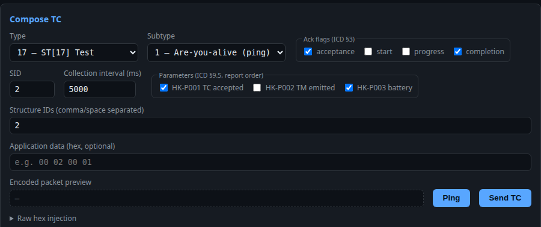

# SPR-003 — Compose form shows all structured HK fields for every type/subtype selection

- Status: Closed (2026-07-19 — SIM-TC-034 full re-run pass at the M1d
  gate, C. Möllmann; fix PR #61)
- Severity: minor (display only; encoded packets are unaffected), with a
  verification-escape note on the SIM-TC-034 gate record (§2)
- Reported: 2026-07-19, project lead (C. Möllmann), manual console use;
  analysis and reproduction by AI assistant per SDP §6
- Affected CI / component: `simulator` web frontend (`style.css` /
  `index.html` compose form); defective since the M1c implementation
  (PR #50), observed on master @ `7aeb8c9`

## 1. Problem description

**Observed:** The compose form shows the structured HK field groups — SID,
collection interval, parameter selection (TC(3,1)) and structure-ID list
(TC(3,5)/(3,7)) — together with the free application-data hex field for
**every** type/subtype selection, e.g. for TC(17,1). All groups are visible
simultaneously; fields that do not apply to the current selection are inert
(not encoded), which is confusing to the user.

**Expected:** Only the field set applicable to the current selection:
TC(3,1) → SID/interval/parameters; TC(3,5)/(3,7) → structure-ID list; every
other selection (incl. custom) → the free application-data hex field only
(SIM-REQ-UI-011, SCR-004 §1.1 "the free application-data hex field is
*replaced* by structured inputs", SIM-TC-034 checklist "selecting TC(3,1)
replaces the free application-data field …; selecting a custom type or
subtype restores free hex entry").

**Evidence:** reproduced headless (Chromium 2026-07-19, static frontend
served stand-alone): with the default TC(17,1) selection all field groups
render — see `docs/assets/spr-003-compose-all-fields.png` (the "Preview
failed: HTTP 501" banner is an artifact of the backend-less reproduction
setup, unrelated). Reported from interactive use against the full simulator.



## 2. Analysis (cause)

The JavaScript visibility logic is **correct**: `syncStructuredFields()`
(`app.js:87–92`) sets the `hidden` attribute on `#hk-create-fields`,
`#hk-sid-list-fields` and `#app-data-row` per selection, and is wired to
both dropdowns and the initial fill. The defect is in the CSS cascade: the
three groups carry `class="row"`, and `style.css:75` declares
`.row { display: flex; … }`. The `hidden` attribute maps to a
**user-agent-origin** `display: none`, which any author-origin `display`
declaration outranks — so `.row[hidden]` still renders as flex. The two
custom type/subtype number inputs hide correctly (no author `display` rule
on `input`), which is why the custom→hex fallback partially works while the
row groups never hide. Verified in Chromium; the cascade rule is
engine-independent.

**Verification-escape note:** SIM-TC-034 was recorded *pass* at the M1c gate
(2026-07-19), but its checklist contains two steps — "replaces the free
application-data field" and "custom … restores free hex entry" — that
cannot have behaved as written, since the defect is present in the M1c
implementation itself. The substantive steps (previews byte-identical to
V-TC-03/04/05, TM(1,8) on interval 50 ms) are unaffected: `composeBody()`
(`app.js:157–165`) selects the encoding inputs by dropdown state, not by
visibility. Consequence: the M1c gate record is impaired for the two
visibility steps only; SIM-TC-034 is to be re-run in full at closure of
this SPR and the fresh verdict recorded in the next milestone report
(verdicts are read cumulatively, SIM-REQ-QA-003 mechanism).

## 3. Disposition (proposed)

**Fix**, frontend-only, one line of CSS: add an author-origin guard

```css
[hidden] { display: none !important; }
```

to `style.css`, restoring the semantics the JS logic already implements.
No document changes required: SIM-REQ-UI-011 already mandates the behavior
and SIM-TC-034 already checks it — the escape was in execution, not in
specification. No SCR is spawned. Closure per SDP §2.4: fixing PR plus full
re-run of SIM-TC-034 (M) with the verdict recorded; regression evidence is
the existing traced manual case, now actually exercising the two visibility
steps.

## 4. Implementation and verification

- Disposition: fix, approved 2026-07-19 via review and merge of PR #57.
- Fix implemented: `[hidden] { display: none !important; }` author-origin
  guard in `style.css` (fixing PR referencing this SPR). Verified headless
  (Chromium): TC(17,1) selection now shows only the free application-data
  field; structured HK groups hidden.
- Closed 2026-07-19: full SIM-TC-034 re-run manual pass at the M1d gate
  (verdict recorded in docs/test-reports/M1d-report.md, C. Möllmann),
  superseding the impaired M1c verdict per §2; all checklist steps
  including the two visibility steps now genuinely exercised.
