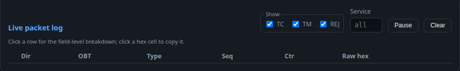

# SPR-006 — "Live packet log" heading not top-aligned in its card

- Status: Analyzed (disposition proposed: reject, baseline silent → convert
  to SCR)
- Severity: minor (presentation; no functional deviation)
- Reported: 2026-07-19, project lead (C. Möllmann), manual console use;
  analysis by AI assistant per SDP §6
- Affected CI / component: `simulator` web frontend (`style.css` /
  `index.html` log card header); present since the SCR-003 log controls
  (M1a), observed on master @ `628be28`

## 1. Problem description

**Observed:** The "Live packet log" heading does not sit in the top-left
corner of its card: it renders noticeably lower, level with the bottom of
the log controls — inconsistent with the "Compose TC" heading, which tops
its card. Evidence: `docs/assets/spr-006-log-heading.png`.

**Expected (reporter):** both card headings aligned identically at the
top-left of their cards.

## 2. Analysis (cause / classification)

The Compose card's `<h2>` is a direct first child of the card and naturally
tops it. The log card's `<h2>` however sits inside `.log-head` together
with the `.log-controls` block (`index.html:94–109`), and `.log-head`
declares `display: flex; align-items: flex-end` (`style.css:144`) — chosen
so the controls hug the table edge, with the side effect that the heading
is bottom-aligned against the taller controls block (the "Show" fieldset
plus its legend). The heading's own bottom margin then floats it slightly
above the baseline, producing the observed "a bit lower" offset.

**Classification per SDP §2.4:** no baselined statement addresses intra-card
heading alignment — SIM-TC-030 checks the log controls' function, SIM-TC-032
the header/compose area; SCR-003 specifies content, not geometry. As with
SPR-004/005 this is baseline-silent presentation — **not a nonconformance**;
the remedy is evolutionary (SCR).

## 3. Disposition (proposed)

**Reject as defect (baseline silent)** and **convert to SCR**: fold into the
pending HMI presentation SCR (sixth item, after SPR-001/002/004/005): align
the log-card heading to the card's top-left like the Compose heading (e.g.
`align-items: flex-start` on `.log-head`, or `align-self: flex-start` on
the heading, keeping the controls' internal layout). This SPR closes as
Rejected with a cross-reference to the implementing SCR once raised.

## 4. Implementation and verification

- Pending disposition. To be recorded here: implementing SCR reference and
  closure (this SPR itself requires no fix).
